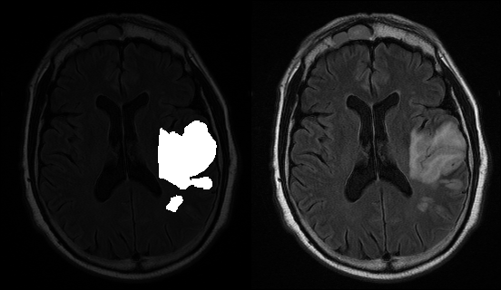

# BrainSegmentation
CS188 Project by Rishub Kumar and Patrick Deshpande

Brain lesions are abnormal tissue in/on brain tissue. We have refined a program (using the pix2pix tensorflow library) that will highlight brain lesions given a png image of a brain. This program will help automate the tedious task of manually highlighting brain lesions, and strives to perform just as well as a human operator.



The left side of this picture is an example of what we want to output, given the image on the right side.

# Instructions for running our project

1) ONLY NECESSARY IF TEST FOLDER HAS DICOM IMAGES: If your test folder contains dicom images, run this command to create a new folder with png versions of those images (Copy the test folder into this directory first)

```sh
python mritopng.py -f <folder_with_dicom> <output_png_dir>
```

2) Now, we have a directory of png images that we want to highlight the lesions in. To do so, run the command:

```sh
./run.sh <input_png_dir>
```

If you performed step one, output_png_dir = input_png_dir. Otherwise, input_png_dir is the folder of png images you want to highlight.

Note that you may need to add permissions to run.sh

This command will open a web browswer that shows the original image and our output image side by side